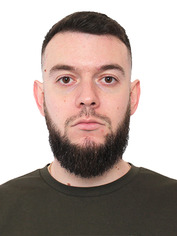

# rsschool-cv



# Oleg Grekov

## Contacts

**Location:** Odessa, Ukraine  
**Phone:** +380 93 721 90 77  
**Email:** [broGrekov@gmail.com](broGrekov@gmail.com)  
**[GitHub](https://github.com/broGrek)**  
**[LinkedIn](https://www.linkedin.com/in/oleg-grekov-b29364269)**  
**Instagram:** broGrek  
**Discord:** grek5723  

## About Me

I am currently an engineer, but my plans for the future are to change my occupation to the IT sphere.  
My wealth of knowledge is very small, but I am a fast learner, and most importantly, there is a desire  

## Skills

+ HTML  
+ CSS  
+ Figma  
+ JS(basic)  

## Code Examples

```
let arr = [1, 2, 3, 4, 5,];  
let sum = 0;  
let result = getSum(arr);  
function getSum(arr) {  
    for (let elem of arr) {  
        sum += elem;  
    }  
    return sum;  
}  
console.log(result);
```

## Education

Odessа Polytechnic National University  
master's degree: mechanical engineer  

## Languages

+ Russian - native  
+ Ukrainian - upper-intermediate  
+ Bulgarian - elementary  
+ English - beginer
